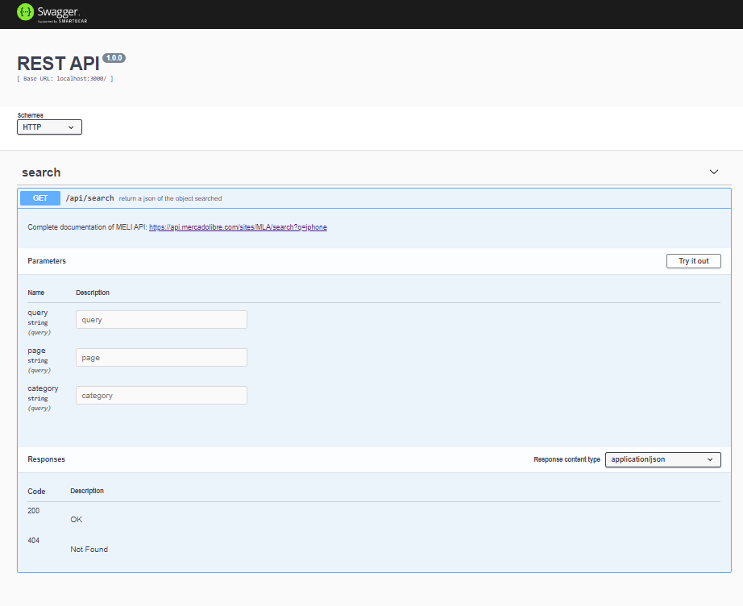
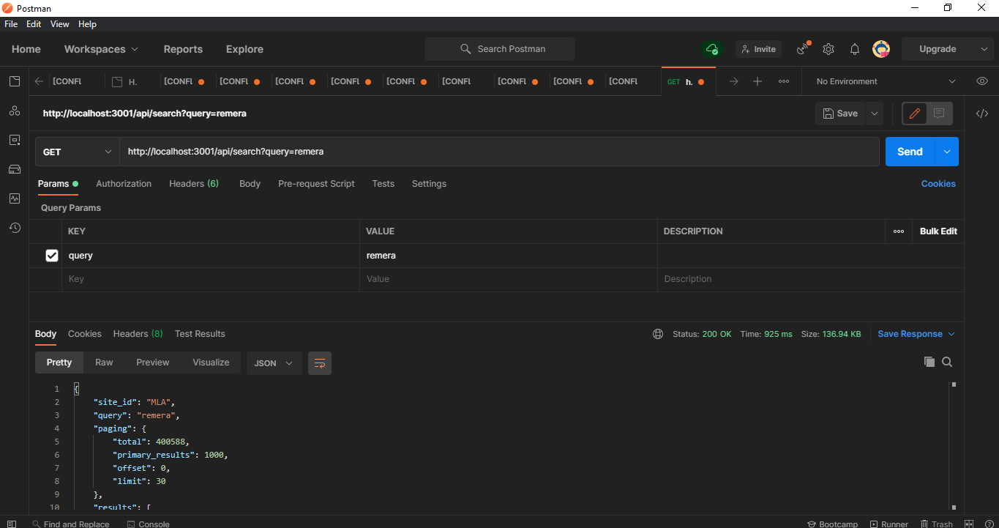

# MINI-Merchant
> Un mini ecommerce usando la api de ML

Hago un Front-End y un Back-End que interactua con una API externa.

## Back-End

- Se uso el siguiente endpoint de Mercado Libre `https://api.mercadolibre.com/sites/MLA/search?q={query}`.
- Hago una cache para no repetir llamadas.

> Podemos ver la documentación completa del endpoint en [este link](https://api.mercadolibre.com/sites/MLA/search?q=iphone).

### Endpoints
#### Swagger:
> `http://localhost:3001/doc/`

#### /api/search

## Front-End
> Dispara request a la API(BACK-END) por medio de un formulario **controlado**

- Permite buscar producto.
- Muestra un catalogo de lo buscado con sus atributos.
- Filtrar por mayor precio, menor precio, nuevos y usados.
- Limpiar el filtrado.
- Paginado.

## Lenguaje
- JavaScript
## Tecnologias
### BackEnd:
- NodeJS
- Express
- Swagger
### FrontEnd:
- React
- React-Router
- Redux
- Bootstrap
- Material-ui
- Fontawesome

## Instrucciones
- npm install (en api y client)
- npm run swagger-autogen en api y npm start en client